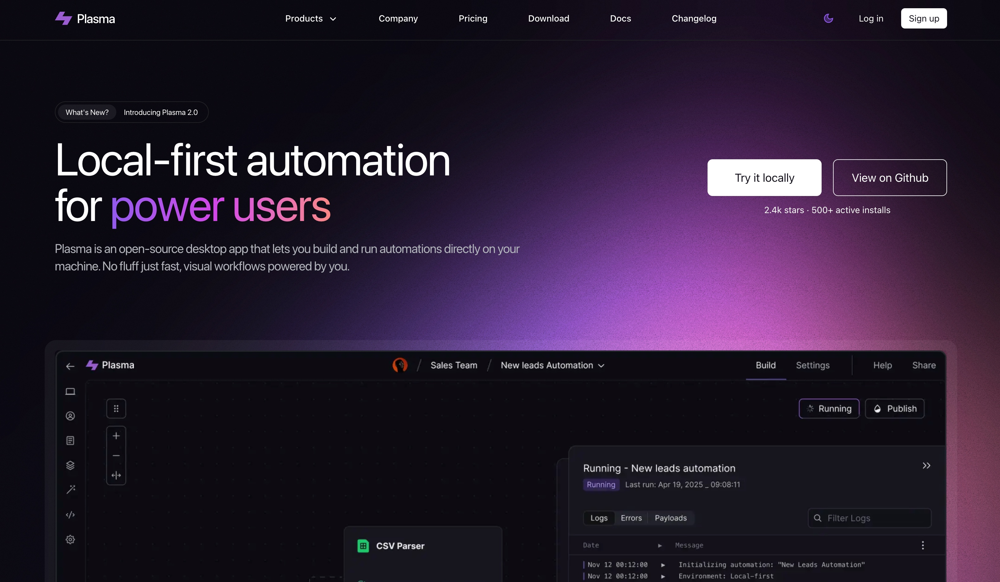

# Plasma Astro Template

Plasma Astro Template is a premium template built by https://www.shadcnblocks.com

- [Demo](https://plasma-astro-template.vercel.app/)
- [Documentation](https://docs.shadcnblocks.com/templates/getting-started)

## Screenshot



## Getting Started

```bash
# Install dependencies
npm install

# Run the development server
npm run dev
```

Open [http://localhost:4321](http://localhost:4321) with your browser to see the result.

## Tech Stack

- Astro 4.x
- Tailwind CSS
- shadcn/ui (Ported to Astro)

## Content

### Changelog (`src/content/changelog/`)

The template includes a structured changelog system using MDX files. Each changelog entry contains:

- Title and date
- Detailed description of updates and new features
- Clean formatting and organization
- Support for markdown content and rich formatting

### Documentation (`src/content/docs/`)

The template includes a comprehensive documentation system built with [Starlight](https://starlight.astro.build/getting-started/), a full-featured documentation theme for Astro. The documentation covers:

- **Installation** - Setup and getting started guide
- **Core Concepts** - Understanding the template architecture
- **AI Prompts** - Working with AI-powered features
- **File Systems** - File organization and structure
- **CRM CSV** - Data management capabilities

Documentation is powered by Starlight's advanced features including automatic navigation, search functionality, responsive design, and support for rich markdown formatting, code highlighting, and interactive components.

## Deploy

You can deploy this template to your preferred hosting platform that supports Astro applications. Some recommended options include:

- [Netlify](https://netlify.com)
- [Vercel](https://vercel.com)
- [Cloudflare Pages](https://pages.cloudflare.com)
